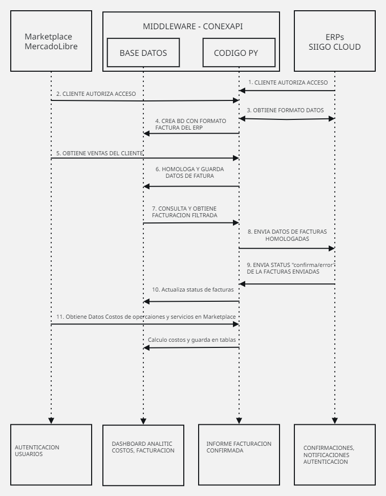

# 📁 Ruta: conexapi_backend/docs/FLUJO.md  
# 🧾 Archivo: FLUJO.md  
# 🎯 Objetivo: Documentar el flujo de datos oficial del sistema ConexAPI, enumerando cada paso secuencial validado por el usuario.  
# 📌 Estado: Completado. Contiene descripción de los 11 pasos oficiales y referencia al gráfico aprobado.

# 🔁 Flujo Oficial de ConexAPI – Middleware

Este documento describe el flujo secuencial completo del sistema ConexAPI, que sincroniza ventas de marketplaces con un ERP, aplicando validaciones, homologaciones y control de costos.

---

## 🔢 Pasos Secuenciales

1. **Autorización cliente en ERP (SIIGO Cloud)**  
   El cliente proporciona su Usuario API y Access Key para permitir conexión al ERP.

2. **Autorización cliente en Marketplace (MercadoLibre)**  
   El cliente autoriza a ConexAPI mediante OAuth2.

3. **Obtener formato de datos del ERP**  
   Se consulta el esquema que SIIGO espera para ventas.

4. **Crear estructura BD adaptada al ERP**  
   Se genera o ajusta la base de datos local según ese formato.

5. **Obtener ventas del Marketplace**  
   Se consultan las órdenes desde la cuenta autorizada del cliente en MercadoLibre.

6. **Homologar y guardar en BD**  
   Los datos crudos se transforman y almacenan en formato ERP-compatible.

7. **Consultar y filtrar facturación**  
   Se listan las ventas listas para facturar desde el sistema.

8. **Enviar a SIIGO Cloud**  
   Las ventas homologadas se envían vía API a SIIGO.

9. **Confirmación o error del ERP**  
   Se recibe la respuesta del ERP y se registra el estado.

10. **Actualizar status de facturas**  
    Se actualizan los registros locales con el resultado.

11. **Obtener y calcular costos operativos**  
    Se calcula el costo por venta/plataforma y se evalúa la rentabilidad.

---

## 📷 Gráfico de Secuencia

> Referencia visual validada por el cliente (imagen adjunta):  
> 

---

### 🔧 Observaciones
- Este flujo es obligatorio para todos los sprints futuros.
- Cada sprint implementará uno o más pasos de este flujo, en orden.

Estos pasos son la columna vertebral del proyecto ConexAPI. A partir de aquí, puedo reformular los sprints detallados, uno por uno, alineados 100% con este flujo y listos para ejecutar como lo establecimos.
